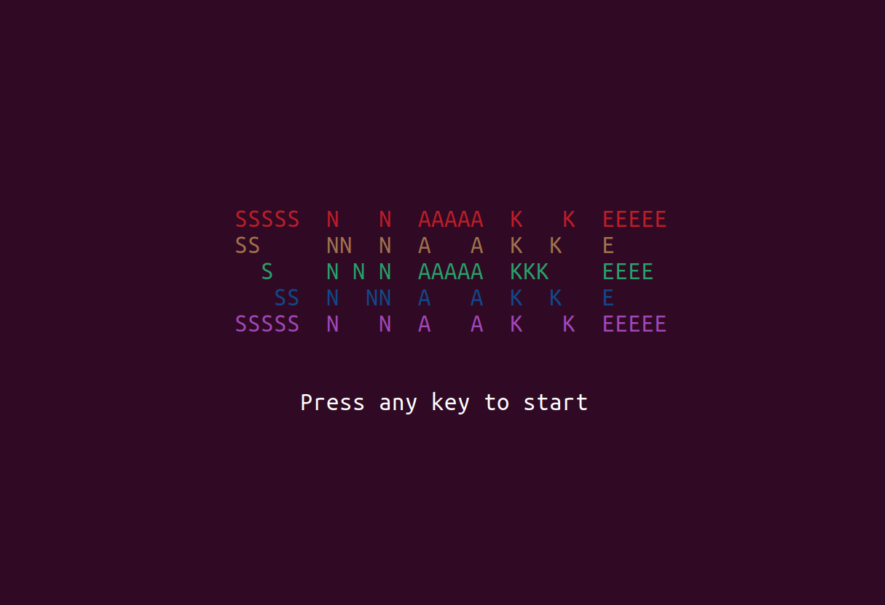
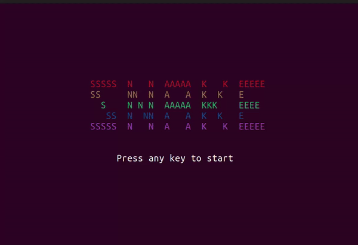

# Project Proposal: Snake

> **Group Member**
>
> - [Jianke Yang](https://github.com/jiankeyang)
> - [Zhongming Yu](https://github.com/fishmingyu)
> - [Yuhang Xie](https://github.com/scarletxyh)
> - [Yulei Liu](https://github.com/lyl1551)

## Overview

This project aims to develop an interactive version of the classic arcade game Snake using Haskell, with a primary focus on utilizing the `brick` library for terminal-based UI. The game involves a snake moving around a plane, consuming food, and growing in length while avoiding collisions with itself or the game boundaries.

## Core Functions

- **Basic Gameplay Mechanics**: Implement the fundamental mechanics of Snake, including snake movement, food generation, and score tracking.
- **Terminal-Based UI**: Utilize the `brick` library to create a responsive and visually appealing terminal interface.
- **Game State Management**: Efficiently handle game state changes (e.g., snake growth, food consumption) in Haskell, showcasing functional programming paradigms.

## Additional Features

We plan to implement some of the add-on features listed below.

- **Difficulty Levels**: Introduce multiple difficulty levels by varying the speed of the snake or complexity of the layout.
- **Leaderboard**: Implement a local leaderboard to track high scores, encouraging repeated play.
- **Customizable Appearance**: Allow players to customize the appearance of the snake and game board (e.g., colors, symbols).
- **Power-Ups**: Introduce power-ups that temporarily modify gameplay, such as speed boosts or score multipliers.
- **Replay Functionality**: Provide a replay feature to allow players to view past games.
- **Random Map**: Generate random maps with diverse boundaries and obstacles.
- **Multiplayer Mode**: Explore the possibility of a local multiplayer mode where two players can compete on the same board.

## MileStone

<p align="center">

</p>

### How to Run

```
stack build
stack run
stack test
```

### Final Features

- **Cover**: The game welcomes players with an eye-catching cover screen, featuring a pixel-art style title and a prompt to start the game. This screen sets the tone and immerses players right from the beginning.
- **Puzzle**: Challenging puzzles in the form of various barrier layouts are a core part of the game's experience. These include square barriers, cross barriers, diagonal barriers, and more, offering diverse challenges.
- **Random Map**: Each game session offers a new experience with randomly generated maps. The layout of barriers and obstacles changes, requiring players to adapt their strategy each time they play.
- **Dynamic Game Speed**:The game's speed dynamically adjusts as the player progresses, increasing the difficulty and excitement. This feature keeps players engaged and challenges their reflexive responses.
- **Timer**: A timer is displayed, adding a sense of urgency and challenge. It encourages players to beat their best times, adding a competitive edge to the game.
- **UnitTest**:The game's robustness is ensured through comprehensive unit testing, covering various aspects of the gameplay and mechanics. This guarantees a smooth and bug-free gaming experience.
- **Tips&Help**: A dedicated section provides players with helpful tips and guidance. Whether you're a beginner or looking to improve your strategy, this section offers valuable insights to enhance your gameplay.

### Collaboration

- Zhongming Yu: Random Map & Barrier Logic & Cover
- Jianke Yang:
- Yuhang Xie:
- Yulei Liu: Timer & Tick Logic & Presentation

## Demo

<p align="center">

</p>
